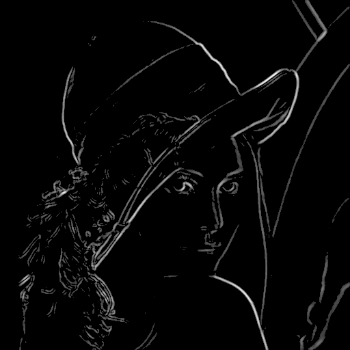
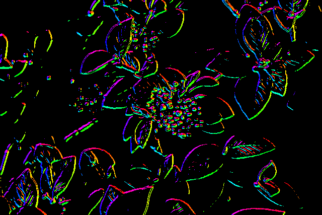

# Image-Processing
Simple image processing which includes grayscaling, gaussian blur and Sobel operator.
These filters as well as the kernel convolution are fully implemented in header files.

## Kernel Convolution
The function first runs a convolution without edges and processes them in the next step depending on option. The methods for edge handling can be selected from "Extend", "Wrap", "Mirror" or without handling the edges.

## Gaussian Blur
There two gaussian blur functions: 
```c++
template <typename T>
void gaussianBlur(const T *img_in, size_t width, size_t height, size_t channels, T *img_out, size_t ksize, Border border);

template <typename T>
void gaussianBlurSeparate(const T *img_in, size_t width, size_t height, size_t channels, T *img_out, size_t ksize, Border border);
```
which differ in perfemance. The first one applies the kernel on an image as usual. The second function runs more effient by separating the kernel in two and applying the convolution twice.   

## Sobel operator
In order to get a proper result the image will be prepcoessed with a gray filter and a gaussian blur. The function then applies a convolution with the Sobel kernel in the x-Direction and in the y-direction. The magnitude can be calculated by pythagoras theorem and the gradient by the arctan, which will show an edge with corresponding angel/orientation

# Running the code
To run the code you can use the provided CMakeLists file. Create a `build` folder and use the command `cmake ..` and then`make` to get the executable.
Run the program with the following command:

`./main input output [-gray"r g b"] | [-gaussian"seperate kSize border"] | [-sobel"kSize gausskSize threshold gradient"]`

- input: input file .bmp as extension.
- output: output file with .bmp as extension.
- gaussian: gaussian filter with "seperate" "kSize" "border" as parameter. If seperate = 0 then the image will be processed once with a kSize x kSize Kernel, otherwise image will be processed twice with a 1 x kSize and a kSize x 1 kernel. Border can be chosen between 0 | 1 | 2 | 3, 0 = WO, 1 = EXTEND 2 = MIRROR, 3 = WRAP. 
- sobel: sobel operator with a kSize x kSize Kernel. The image will be preprocessed with a grayfilter and a gausskSize x gausskSize gaussian Filter. The threshold is a number for an edge to be recognized between 0 <= threshold <= 255 (ideally about 150). If gradient = 1 then the gradient (orientation) will be also shown in colors.

Notice that the main prgramm only supports .bmp files with color depth = 24. If you the following error: `constexpr function's return type 'Kernel' (aka 'vector<std::vector<float>>') is not a literal type` you should us a different compiler like gcc 12

## Results

### Gray
|Original|Luminance|Original|Luminance|
|:---:|:---:|:---:|:---:|
||||

### Gaussian blur
|Original|ksize = 5|ksize = 17|ksize = 51|
|:---:|:---:|:---:|:---:|
||||

|Original|ksize = 5|ksize = 17|ksize = 51|
|:---:|:---:|:---:|:---:|
||||

### Sobel operator
|Original|ksize = 5|ksize = 7|Gradient|
|:---:|:---:|:---:|:---:|
||||

|Original|ksize = 5|ksize = 7|Gradient|
|:---:|:---:|:---:|:---:|
||||


